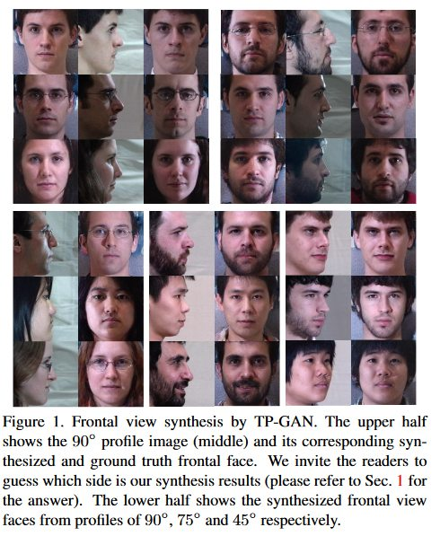
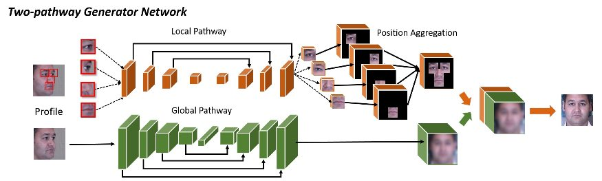
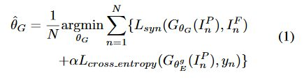
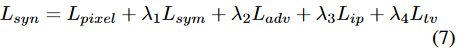
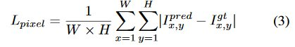
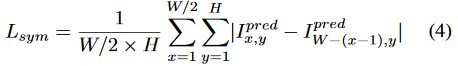
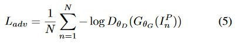
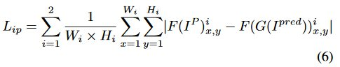
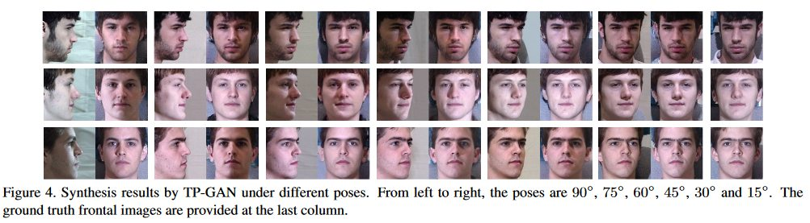
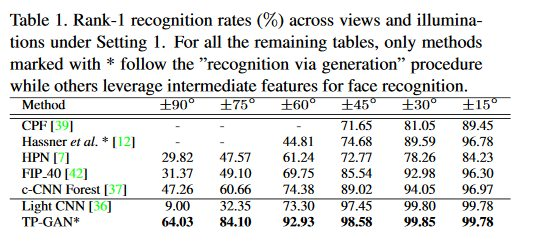

# Beyond Face Rotaion: Global and Local Perception GAN for Photorealistic and Identity Preserving Frontal View Synthesis
## TP-GAN (Two-Pathway Generative Adversarial Network)

### タスク
人の横顔から正面の顔を生成するGAN(Fig.1)

### 構成
個別のパーツを生成するGeneratorと、輪郭を生成するGeneratorをパラで用意し、
それぞれから生成された画像を合成して正面の画像にする。

### Lossの定義
それぞれのGeneratorはCNNのEncoderとDecoderより構成されており、
式1よりGeneratorのパラメータθを最適化する。

* Grobal pathwayのエンコーダがボトルネックになっているらしく、個別のロスを定義している。αL_closs_entropy....

* L_synのロスは以下の5つのロスから構成される。

1. Pixel上でのロス
Ground truthと生成された画像とのピクセルごとの差分

2. 対象性ロス
生成された画像が左右対称かどうかをピクセルごとに計算

3. Adversarialロス
GANのいつものロス（うまく騙せたかどうか）

4. Identity Preservingロス
Light CNNの最後の2層を使い、
横顔を入力した結果と生成された画像を入力した結果との差。

5. Total Variation regularization
よくCNNで使われるロス。画像を滑らかにする制約になる。

### 結果
各角度からの生成で認識性能がSOTA(Fig.4, Table 1)

